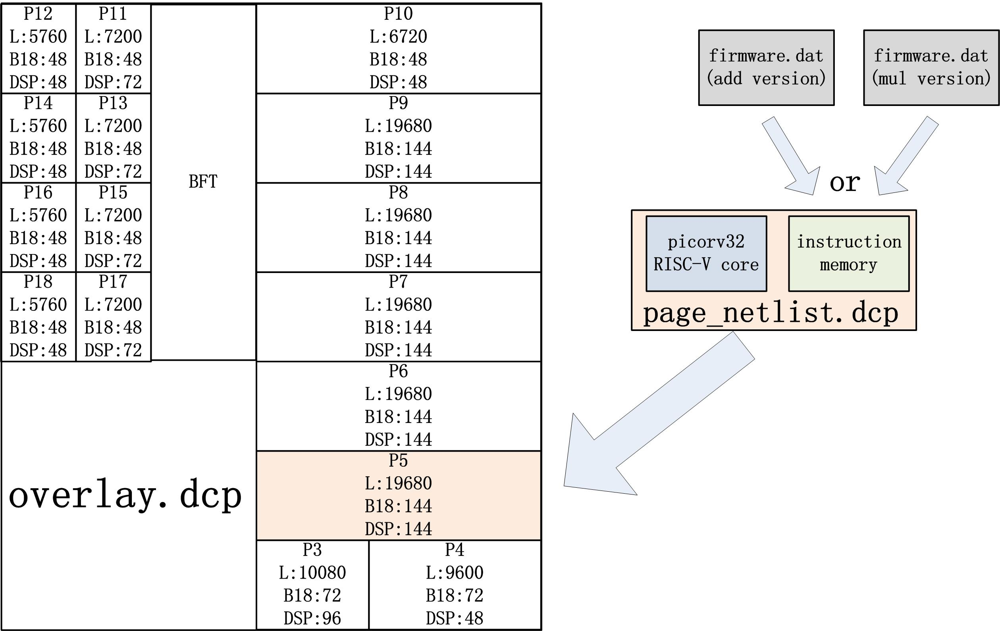
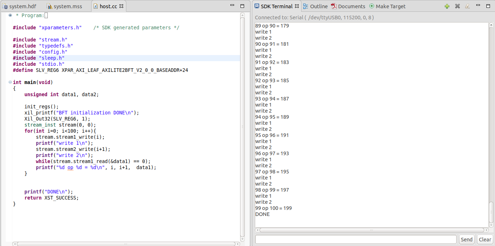
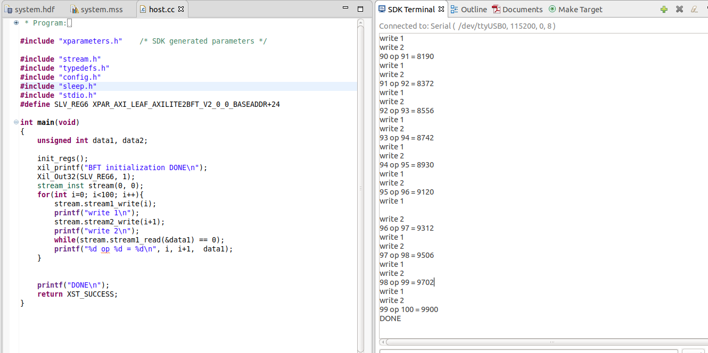

# pr_example_for_BERT
## Short Description
This is a repo with partial reconfiguration dcp files for [BERT](https://github.com/byuccl/bert).
All the DCP and SDK project are developed with vivado 2018.3.
You can run the flow with [ZCU102 board](https://www.xilinx.com/products/boards-and-kits/ek-u1-zcu102-g.html).
As shown in the figure below, ./overlay/overlay.dcp is the static DCP file, and the ./overlay/main.bit is the static bitstream.
Two versions of partial bitstreams will be generated for page 5 by loading page_netlist.dcp file into overlay.dcp. 
The page_netlist.dcp can be generated with 2 versions of firmware.dat. With different firmware.dat loaded into BRAMs, the RISC-V
will have different functionalities.

## How to run the project?
1. Set the vivado source file in the makfile
2. Open the SDK project under SDK.
3. Download the static and partial bitstreams by 'make add' for add version. Run the SDK project. You should see the 2 inputs are added.

4. Download the static and partial bitstreams by 'make mul' for mul version. Run the SDK project. You should see the 2 inputs are multiplied.

## Userfull location
static dcp file: ./overlay/overlay.dcp
partial dcp file for risc-v with add functionality: ./pr_page/page_add_netlist.dcp
partial dcp file for risc-v with mul functionality: ./pr_page/page_mul_netlist.dcp
dat file for risc-v with add functionality: ./pr_page/riscv_add_dat/firmware0-3.dat
dat file for risc-v with mul functionality: ./pr_page/riscv_mul_dat/firmware0-3.dat
