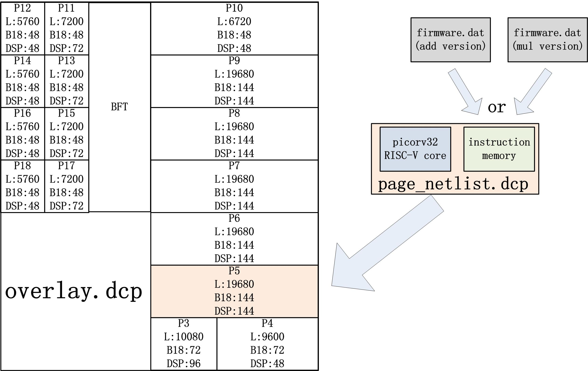

# pr_example_for_BERT
## Short Description
All the DCP and SDK project are developed with vivado 2018.3.
This is an example for PRFlow partial reconfiguration.
You can run the flow with Ultra96-v2.
./overlay/overlay.dcp is the static DCP file, and the ./overlay/main.bit is the static bitstream.
Two versions of partial bitstreams will be generated. The only difference is the files under ./pr_page/riscv_add_dat and ./pr_page/riscv_mul_dat.
The two picorv_mem.v point to different instruction memories (firmware0-4.hex).

## How to run the project.
1. Set the vivado source file in the makfile
2. Open the SDK project under ./u96_pr.sdk.
3. Download the static and partial bitstreams by 'make add' for add version. Run the SDK project. You should see the 2 inputs are added.
4. Download the static and partial bitstreams by 'make mul' for mul version. Run the SDK project. You should see the 2 inputs are multiplied.
